# Jarkom-Modul-2-IT08-2024

## Topologi 2

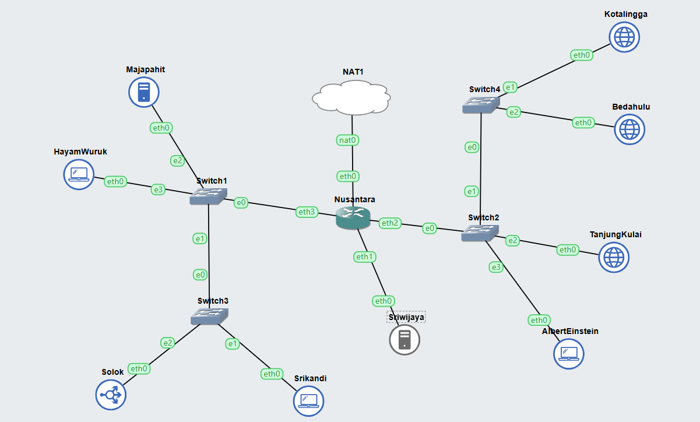

## Soal 1

1. Menjalankan script `dns_master.sh` di node **Sriwijaya** dengan isi sebagai berikut:

   ```
   #!/bin/bash

   cat <<EOF >> /etc/bind/named.conf.local
   zone "sriwijaya.com" {
       type master;
       also-notify { 192.237.3.3; };
       allow-transfer { 192.237.3.3; };
       file "/etc/bind/jarkom/sriwijaya.com";
   };

   zone "1.237.192.in-addr.arpa" {
       type master;
       file "/etc/bind/jarkom/1.237.192.in-addr.arpa";
   };
   EOF

   mkdir -p /etc/bind/jarkom

   cat <<EOF > /etc/bind/jarkom/sriwijaya.com
   ;
   ; BIND data file for local loopback interface
   ;
   \$TTL    604800
   @       IN      SOA     sriwijaya.com. root.sriwijaya.com. (
                                 2         ; Serial
                            604800         ; Refresh
                             86400         ; Retry
                           2419200         ; Expire
                            604800 )       ; Negative Cache TTL
   ;
   @       IN      NS      sriwijaya.com.
   @       IN      A       192.237.1.2
   www     IN      CNAME   sriwijaya.com.
   @       IN      AAAA    ::1
   EOF

   cat <<EOF > /etc/bind/jarkom/1.237.192.in-addr.arpa
   ;
   ; BIND data file for local loopback interface
   ;
   \$TTL    604800
   @       IN      SOA     sriwijaya.com. root.sriwijaya.com. (
                                 2         ; Serial
                            604800         ; Refresh
                             86400         ; Retry
                           2419200         ; Expire
                            604800 )       ; Negative Cache TTL
   ;
   1.237.192.in-addr.arpa       IN      NS      sriwijaya.com.
   2                            IN      PTR     sriwijaya.com.
   EOF

   service bind9 restart
   ```

2. Menjalankan script `dns_slave.sh` di node **Majapahit** dengan isi sebagai berikut:

   ```
   #!/bin/bash

   cat <<EOF >> /etc/bind/named.conf.local
   zone "sriwijaya.com" {
       type slave;
       masters { 192.237.1.2; };
       file "/var/lib/bind/sriwijaya.com";
   };
   EOF

   service bind9 restart
   ```

3. Menjadikan **Tanjungkulai** dan **Bedahulu** sebagai web server. Simpan script di bawah dengan nama `web_server.sh`.

   ```
    #!/bin/bash

    apt-get update
    apt-get install lynx -y
    apt-get install apache2 -y
    apt-get install php -y
    apt-get install php libapache2-mod-php -y
   ```

## Soal 2

1. Menambahkan domain **sudarsana.it08.com** yang mengarah ke Solok dengan ip `192.237.3.6`

   ```
   #!/bin/bash

   cat <<EOF >> /etc/bind/named.conf.local
   zone "sudarsana.it08.com" {
       type master;
       also-notify { 192.237.3.3; };
       allow-transfer { 192.237.3.3; };
       file "/etc/bind/jarkom/sudarsana.it08.com";
   };
   EOF

   cat <<EOF > /etc/bind/jarkom/sudarsana.it08.com
   ;
   ; BIND data file for local loopback interface
   ;
   \$TTL    604800
   @       IN      SOA     sudarsana.it08.com. root.sudarsana.it08.com. (
                                 2         ; Serial
                            604800         ; Refresh
                             86400         ; Retry
                           2419200         ; Expire
                            604800 )       ; Negative Cache TTL
   ;
   @       IN      NS      sudarsana.it08.com.
   @       IN      A       192.237.3.6
   www     IN      CNAME   sudarsana.it08.com.
   @       IN      AAAA    ::1
   EOF

   service bind9 restart
   ```

   **Hasil** <br>

   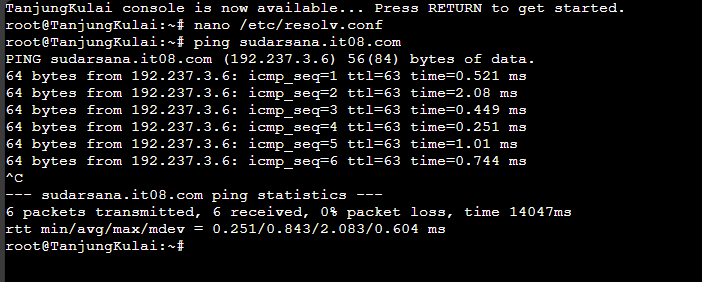

## Soal 3

1. Menambahkan domain **pasopati.it08.com** yang mengarah ke Kotalingga dengan ip `192.237.2.5`

   ```
   #!/bin/bash

   cat <<EOF >> /etc/bind/named.conf.local
   zone "pasopati.it08.com" {
       type master;
       also-notify { 192.237.3.3; };
       allow-transfer { 192.237.3.3; };
       file "/etc/bind/jarkom/pasopati.it08.com";
   };
   EOF

   cat <<EOF > /etc/bind/jarkom/pasopati.it08.com
   ;
   ; BIND data file for local loopback interface
   ;
   \$TTL    604800
   @       IN      SOA     pasopati.it08.com. root.pasopati.it08.com. (
                                 2         ; Serial
                            604800         ; Refresh
                             86400         ; Retry
                           2419200         ; Expire
                            604800 )       ; Negative Cache TTL
   ;
   @       IN      NS      pasopati.it08.com.
   @       IN      A       192.237.2.5
   www     IN      CNAME   pasopati.it08.com.
   @       IN      AAAA    ::1
   EOF

   service bind9 restart
   ```

   **Hasil** <br>

   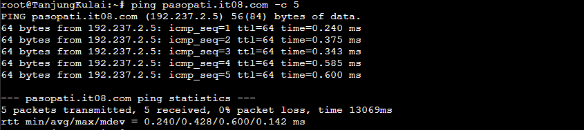

## Soal 4

1. Menambahkan domain **rujapala.it08.com** yang mengarah ke Tanjungkulai dengan ip `192.237.2.2`

   ```
   #!/bin/bash

   cat <<EOF >> /etc/bind/named.conf.local
   zone "rujapala.it08.com" {
       type master;
       also-notify { 192.237.3.3; };
       allow-transfer { 192.237.3.3; };
       file "/etc/bind/jarkom/rujapala.it08.com";
   };
   EOF

   mkdir -p /etc/bind/jarkom

   cat <<EOF > /etc/bind/jarkom/rujapala.it08.com
   ;
   ; BIND data file for local loopback interface
   ;
   \$TTL    604800
   @       IN      SOA     rujapala.it08.com. root.rujapala.it08.com. (
                                 2         ; Serial
                            604800         ; Refresh
                             86400         ; Retry
                           2419200         ; Expire
                            604800 )       ; Negative Cache TTL
   ;
   @       IN      NS      rujapala.it08.com.
   @       IN      A       192.237.2.2
   www     IN      CNAME   rujapala.it08.com.
   @       IN      AAAA    ::1
   EOF

   service bind9 restart
   ```

   **Hasil** <br>

   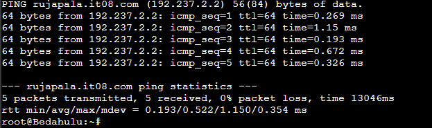

## Soal 5

- HayamWuruk
  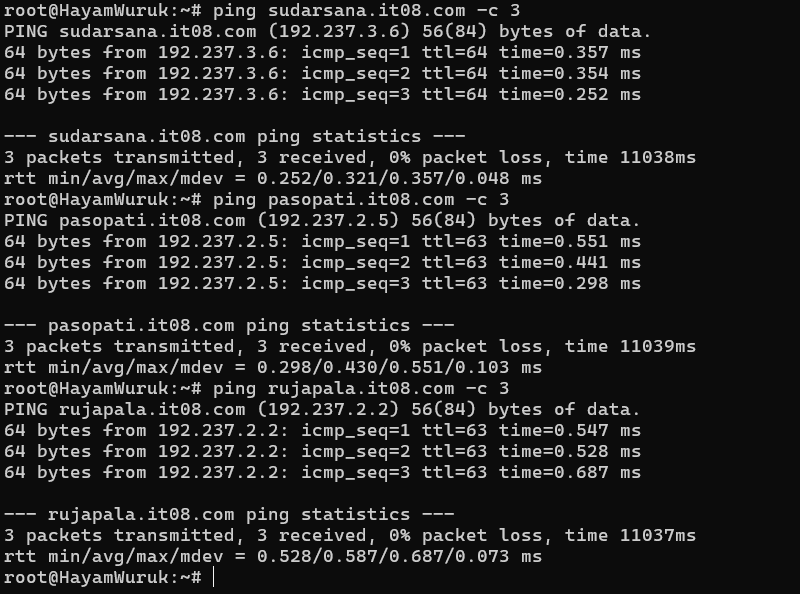

- AlbertEinstein
  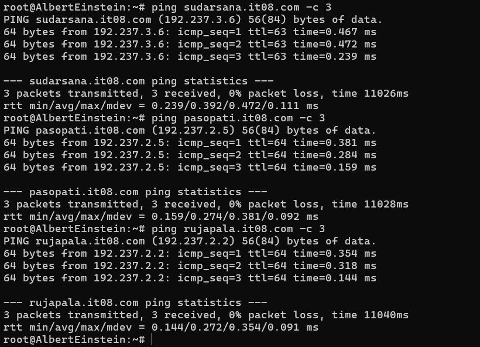

- Srikandi

  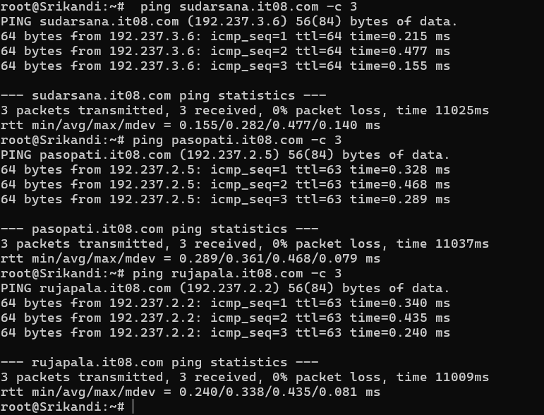

## Soal 6

1. Mengatur kembali `/etc/bind/named.conf.local` pada DNS Master (Sriwijaya) dan menambahkan script berikut:

   ```
   zone "2.237.192.in-addr.arpa" { // IP dari Kotalingga 192.237.2.5
    type master;
    file "/etc/bind/jarkom/2.237.192.in-addr.arpa";
   };
   ```

2. Pada `/etc/bind/jarkom/2.237.192.in-addr.arpa` tambahkan:

   ```
   ;
   ; BIND data file for local loopback interface
   ;
   $TTL    604800
   @       IN      SOA     pasopati.it08.com. root.pasopati.it08.com. (
                                 2         ; Serial
                            604800         ; Refresh
                             86400         ; Retry
                           2419200         ; Expire
                            604800 )       ; Negative Cache TTL
   ;
   2.237.192.in-addr.arpa.       IN      NS      pasopati.it08.com.
   5                             IN      PTR     pasopati.it08.com.
   ```

   **Hasil** <br>

   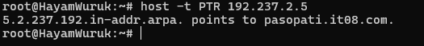

## Soal 7

1. Menambahkan script di bawah untuk tiap domain di `/etc/bind/named.conf.local`. Hal ini sudah diterapkan sebelumnya.

   ```
   also-notify { 192.237.3.3; };
   allow-transfer { 192.237.3.3; };
   ```

2. Pada node Majapahit, kita perlu menambahkan script berikut pada `/etc/bind/named.conf.local`.

   ```
   zone "sudarsana.it08.com" {
    type slave;
    masters { 192.237.1.2; };
    file "/var/lib/bind/sudarsana.it08.com";
   };

   zone "pasopati.it08.com" {
       type slave;
       masters { 192.237.1.2; };
       file "/var/lib/bind/pasopati.it08.com";
   };

   zone "rujapala.it08.com" {
       type slave;
       masters { 192.237.1.2; };
       file "/var/lib/bind/rujapala.it08.com";
   };
   ```

3. Jangan lupa untuk memasukkan `nameserver 192.237.3.3` ke dalam `/etc/resolv.conf` client

   **Hasil** <br>

   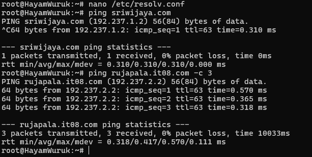

## Soal 8

1. Pada `/etc/bind/jarkom/sudarsana.it08.com`, tambahkan konfigurasi berikut:

   ```
   cakra  IN      A       192.237.2.4 ; IP Bedahulu
   ```

   **Hasil** <br>

   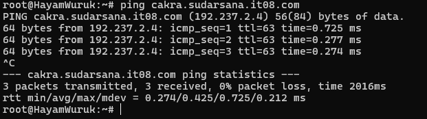

## Soal 9

1. Pada `/etc/bind/jarkom/pasopati.it08.com`, tambahkan konfigurasi berikut:

   ```
   ns1     IN      A       192.237.3.3 ; IP Majapahit
   panah   IN      NS      ns1
   ```

2. Pada `/etc/bind/named.conf.local` di node Majapahit, tambahkan konfigurasi berikut:

   ```
   zone "panah.pasopati.it08.com" {
      type master;
      file "/etc/bind/panah/panah.pasopati.it08.com";
   };
   ```

3. Untuk mendelegasikan subdomain ke Majapahit, kita perlu mengedit `/etc/bind/named.conf.options` pada node Sriwijaya dan Majapahit sebagai berikut:

   ```
   allow-query{any;};
   // dnnsec-validation auto;
   ```

4. Pada `/etc/bind/panah/panah.pasopati.it08.com`, arahkan ke IP Kotalingga `192.237.2.5`

   ```
   ;
   ; BIND data file for local loopback interface
   ;
   $TTL    604800
   @       IN      SOA     panah.pasopati.it08.com. root.panah.pasopati.it08.com. (
                                 2         ; Serial
                            604800         ; Refresh
                             86400         ; Retry
                           2419200         ; Expire
                            604800 )       ; Negative Cache TTL
   ;
   @       IN      NS      panah.pasopati.it08.com.
   @       IN      A       192.237.2.5
   www     IN      A       192.237.2.5
   ```

   **Hasil** <br>

   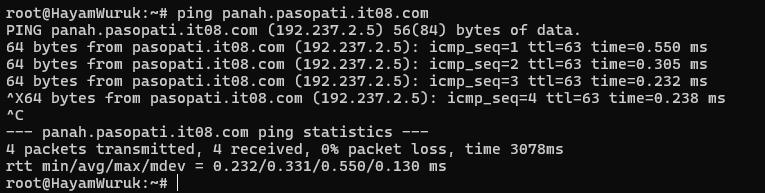

## Soal 10

1. Untuk membuat log, kita dapat melakukan perubahan ke `/etc/bind/panah/panah.pasopati.it08.com` sebagai berikut:

   ```
   log     IN      A       192.237.2.5
   www.log IN      CNAME   www.panah.pasopati.it08.com.
   ```

   **Hasil** <br>

   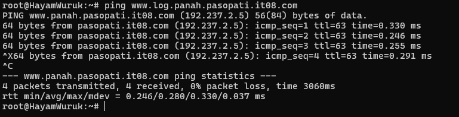

## Soal 11

1. Memforward IP Nusantara melalui DNS Server Majapahit dengan mengedit file `/etc/bind/named.conf.options`

   ```
   options {
       directory \"/var/cache/bind\";

       // If there is a firewall between you and nameservers you want
       // to talk to, you may need to fix the firewall to allow multiple
       // ports to talk.  See http://www.kb.cert.org/vuls/id/800113

       // If your ISP provided one or more IP addresses for stable
       // nameservers, you probably want to use them as forwarders.
       // Uncomment the following block, and insert the addresses replacing
       // the all-0's placeholder.

      forwarders {
         192.168.122.1; // DNS Noesantara Server
      };

       //========================================================================
       // If BIND logs error messages about the root key being expired,
       // you will need to update your keys.  See https://www.isc.org/bind-keys
       //========================================================================
       //dnssec-validation auto;
       allow-query {any;};

       auth-nxdomain no;
       listen-on-v6 { any; };
   }
   ```

2. Memforward IP Nusantara melalui DNS Server Majapahit dengan mengedit file `/etc/bind/named.conf.options` (sama seperti di server Majapahit)

   ```
   options {
      directory \"/var/cache/bind\";

      // If there is a firewall between you and nameservers you want
      // to talk to, you may need to fix the firewall to allow multiple
      // ports to talk.  See http://www.kb.cert.org/vuls/id/800113

      // If your ISP provided one or more IP addresses for stable
      // nameservers, you probably want to use them as forwarders.
      // Uncomment the following block, and insert the addresses replacing
      // the all-0's placeholder.

      forwarders {
         192.168.122.1; // DNS Noesantara Server
      };

      //========================================================================
      // If BIND logs error messages about the root key being expired,
      // you will need to update your keys.  See https://www.isc.org/bind-keys
      //========================================================================
      //dnssec-validation auto;
      allow-query {any;};

      auth-nxdomain no;
      listen-on-v6 { any; };
   }
   ```

3. Mencoba test di clientnya

   ```
   ping google.com -c 5
   ```

   **Hasil** <br>

   
   

## Soal 12

1. Menjalankan script web server di bawah dan menambahkan `nameserver 192.237.1.2` ke dalam `/etc/resolv.conf` milik Kotalingga

   ```
    #!/bin/bash

    apt-get update
    apt-get install lynx -y
    apt-get install apache2 -y
    apt-get install php -y
    apt-get install php libapache2-mod-php -y

    service apache2 start

    cd /etc/apache2/sites-available

    cat <<EOF >> default-8080.conf
    <VirtualHost  *:8080>
      ServerAdmin webmaster@localhost
      DocumentRoot /var/www/web-8080

      ErrorLog \${APACHE_LOG_DIR}/error.log
      CustomLog \${APACHE_LOG_DIR}/access.log combined
    </VirtualHost>
    EOF

    echo "Listen 8080" >> /etc/apache2/ports.conf

    a2ensite default-8080.conf

    service apache2 reload
    service apache2 restart

    mkdir -p /var/www/web-8080

    cd /var/www/web-8080

    cat <<EOF >> index.php
    <?php
      \$hostname = gethostname();
      \$date = date('Y-m-d H:i:s');
      \$php_version = phpversion();
      \$username = get_current_user();

      echo "Hello World!<br>";
      echo "Saya adalah: \$username<br>";
      echo "Saat ini berada di: \$hostname<br>";
      echo "Versi PHP yang saya gunakan: \$php_version<br>";
      echo "Tanggal saat ini: \$date<br>";
    ?>
    EOF
   ```

   **Hasil** <br>

   

## Soal 13

1. Menjalankan script pada nomor 12 untuk node **Bedahulu** dan **Tanjungkulai**.
2. Untuk membuat load balancer, kita perlu menyimpan tiap IP dari worker, yaitu `192.237.2.2` untuk Tanjungkulai, `192.237.2.4` untuk Bedahulu, dan `192.237.2.5` untuk Kotalingga.

   - Pada `/etc/apache2/sites-available/default-8080.conf` di node Solok, ubah konfigurasi menjadi seperti berikut:

   ```
   <VirtualHost *:8080>
    ServerAdmin webmaster@localhost
    DocumentRoot /var/www/web-8080

    <Proxy "balancer://mycluster">
        BalancerMember http://192.237.2.2:8080
        BalancerMember http://192.237.2.4:8080
        BalancerMember http://192.237.2.5:8080
        ProxySet lbmethod=byrequests
    </Proxy>

    ProxyPass "/" "balancer://mycluster/"
    ProxyPassReverse "/" "balancer://mycluster/"
   </VirtualHost>
   ```

   - Jangan lupa untuk menginstall depedencies di bawah agar load balancer bekerja

   ```
   a2enmod lbmethod_byrequests
   a2enmod proxy
   a2enmod proxy_balancer
   a2enmod proxy_http
   ```

   - Jalankan perintah `echo 'Listen 8080' >> /etc/apache2/ports.conf` di node Solok
   - Jalankan `lynx 192.237.3.6:8080` untuk mengakses website dengan load balancer

   **Hasil** <br>

   
   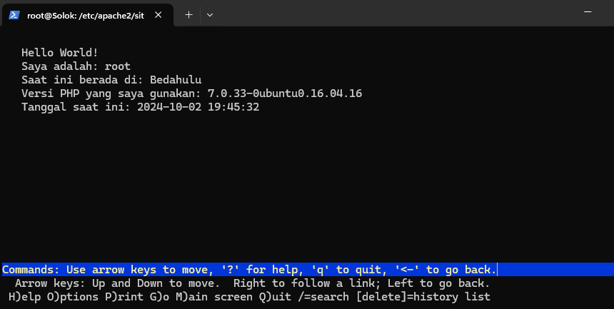
   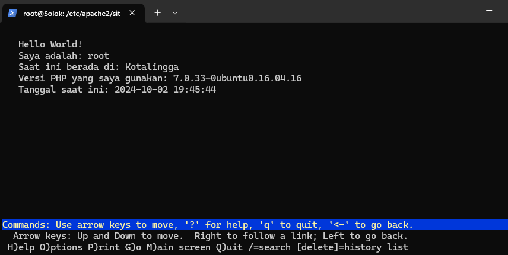

   Website akan terus berganti ketika kita mengulang lynx.

## Soal 14

1. Pada `/etc/nginx/sites-available/web-8080` di nodes Worker

   ```
   server {
     listen 6969;

     root /var/www/web-8080;
     index index.php index.html index.htm index.nginx-debian.html;

     server_name _;

     location / {
             try_files $uri $uri/ /index.php?$query_string;
     }

     location ~ \.php$ {
             include snippets/fastcgi-php.conf;
             fastcgi_pass unix:/run/php/php7.0-fpm.sock;
     }

     location ~ /\.ht {
             deny all;
     }
   }
   ```

2. Jalankan `ln -s /etc/nginx/sites-available/web-8080 /etc/nginx/sites-enabled/web-8080`
3. Jalankan `service php7.0-fpm stop` dan `service php7.0-fpm start`

4. Pada `/etc/nginx/sites-available/web-8080` di node Solok (Load Balancer).

   ```
   upstream backend {
   server 192.237.2.2:6969;
   server 192.237.2.4:6969;
   server 192.237.2.5:6969;
   }

   server {
   listen 69;
   server_name solok.it08.com www.solok.it08.com;

   location / {
       proxy_pass http://backend;
   }
   }
   ```

5. Jalankan `ln -s /etc/nginx/sites-available/web-8080 /etc/nginx/sites-enabled` pada node Solok.

   **Hasil** <br>

   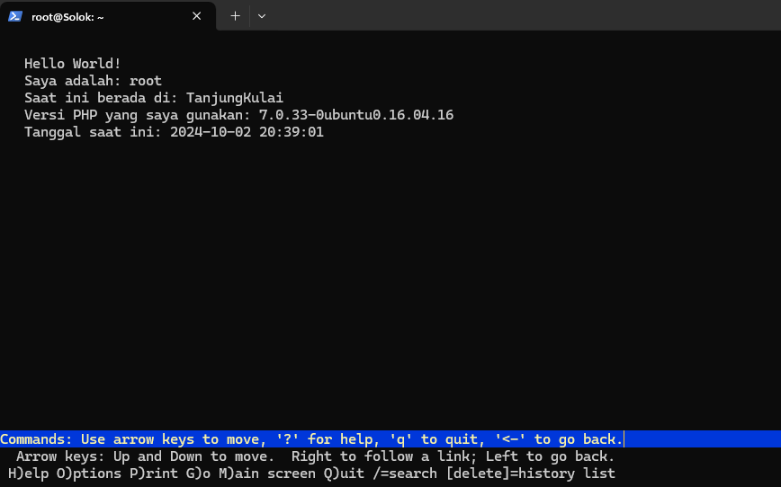
   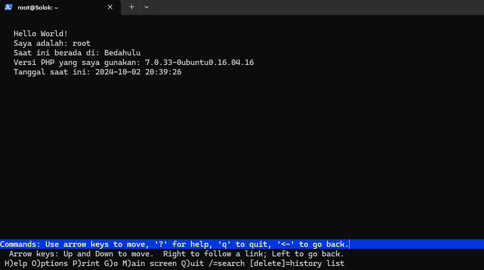
   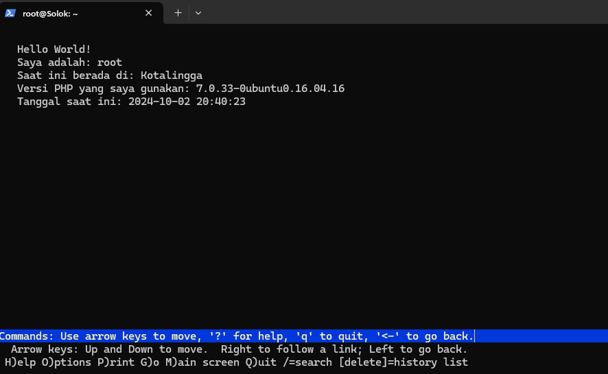

## Soal 15

Lakukan instalasi apache-utils

```
apt-get install apache2-utils
```

Dan tes pada load balancer Solok

```
ab -n 1000 -c 100 http://10.76.2.3/
```
Untuk penjelasan dan analisis, cek di [readme](https://github.com/irfanqs/Jarkom-Modul-2-IT08-2024/blob/main/Laporan%20Hasil%20Benchmark%20No%2015.md) berikut.

## Soal 16

1. Jalankan script berikut

   ```
   #!/bin/bash

   cat <<EOF >> /etc/bind/named.conf.local
   zone "solok.it08.com" {
       type master;
       file "/etc/bind/jarkom/solok.it08.com";
   };
   EOF

   mkdir -p /etc/bind/jarkom

   cat <<EOF >> /etc/bind/jarkom/solok.it08.com
   ;
   ; BIND data file for local loopback interface
   ;
   \$TTL    604800
   @       IN      SOA     solok.it08.com. root.solok.it08.com. (
                                 2         ; Serial
                            604800         ; Refresh
                             86400         ; Retry
                           2419200         ; Expire
                            604800 )       ; Negative Cache TTL
   ;
   @       IN      NS      solok.it08.com.
   @       IN      A       192.237.2.2     ; IP Tanjungkulai
   www     IN      A       192.237.2.2
   EOF

   service bind9 restart
   ```

   **Hasil** <br>

   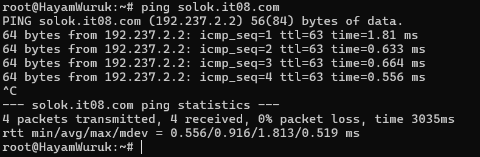
   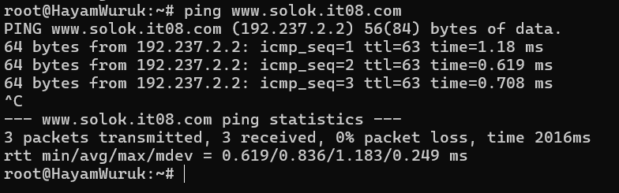

## Soal 17

1. Port yang diinginkan adalah port 31416 dan port 4697
2. Jalankan script berikut pada nodes Tanjungkulai pada file `/etc/nginx/sites-enabled/web-8080`.

   ```
   server {
     listen 31416;

     root /var/www/web-8080;
     index index.php index.html index.htm index.nginx-debian.html;

     server_name solok.it08.com;

     location / {
             try_files $uri $uri/ /index.php?$query_string;
     }

     location ~ \.php$ {
             include snippets/fastcgi-php.conf;
             fastcgi_pass unix:/run/php/php7.0-fpm.sock;
     }

     location ~ /\.ht {
             deny all;
     }
   }

   server {
     listen 4697;

     root /var/www/web-8080;
     index index.php index.html index.htm index.nginx-debian.html;

     server_name solok.it08.com;

     location / {
             try_files $uri $uri/ /index.php?$query_string;
     }

     location ~ \.php$ {
             include snippets/fastcgi-php.conf;
             fastcgi_pass unix:/run/php/php7.0-fpm.sock;
     }

     location ~ /\.ht {
             deny all;
     }
   }
   ```

   **Hasil** <br>

   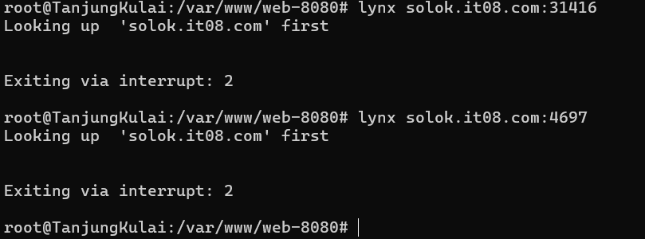
   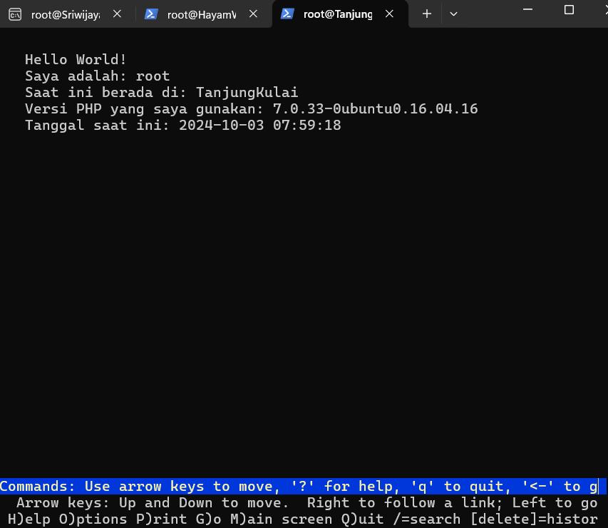
   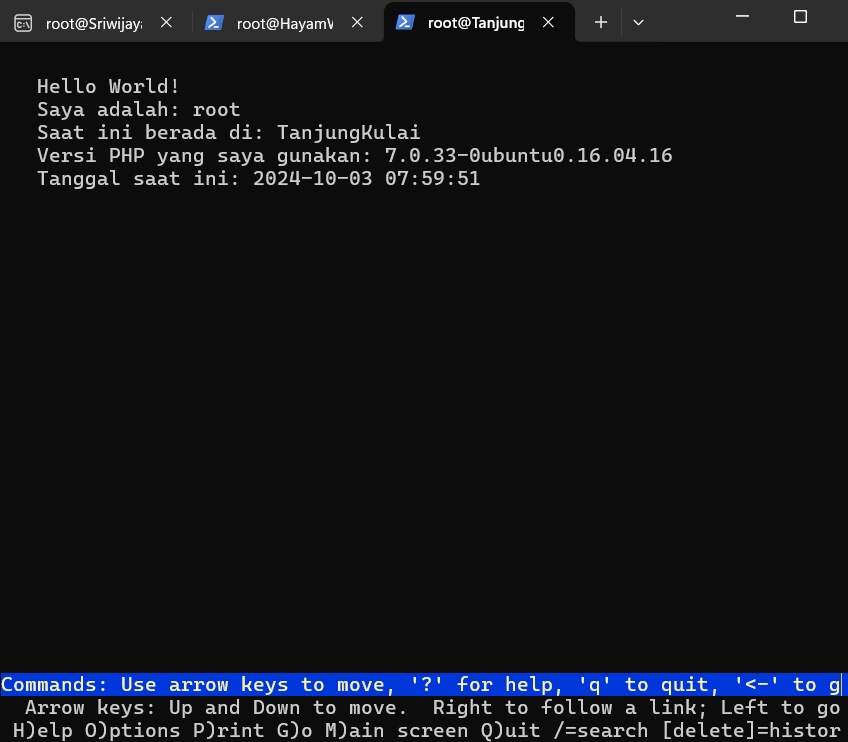

## Soal 18

1. Pada Tanjungkulai, jalankan script berikut pada file `/etc/nginx/sites-enabled/web-8080`.

   ```
   server {
     listen 80;

     root /var/www/web-8080;
     index index.php index.html index.htm index.nginx-debian.html;

     server_name www.solok.it08.com;

     location / {
             try_files $uri $uri/ /index.php?$query_string;
     }

     location ~ \.php$ {
             include snippets/fastcgi-php.conf;
             fastcgi_pass unix:/run/php/php7.0-fpm.sock;
     }

     location ~ /\.ht {
             deny all;
     }
   }

   server {
      listen 80 default_server;
      server_name _;
      return 301 http://www.solok.it08.com;
   }
   ```

   **Hasil** <br>

   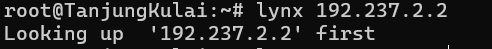
   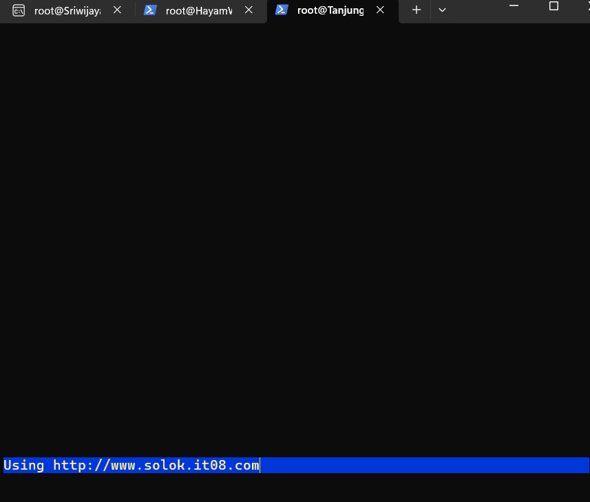
   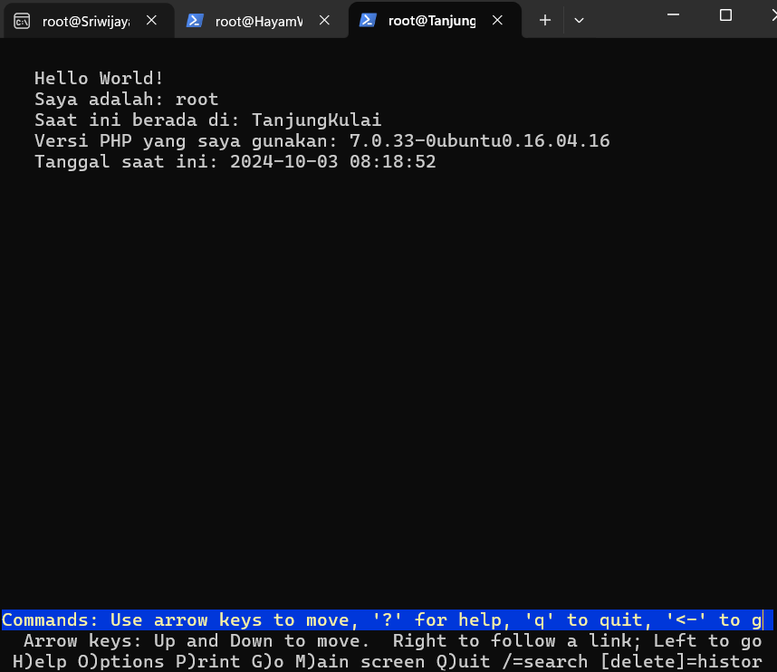

## Soal 19 dan 20

1. Untuk dapat mengakses directory listing dengan domain `sekiantterimakasih.it08.com`, jalankan script berikut di worker (Tanjungkulai):

   ```
   #!/bin/bash

   apt-get install unzip -y
   apt-get install wget -y

   wget --no-check-certificate 'https://drive.usercontent.google.com/u/0/uc?id=1JGk8b-tZgzAOnDqTx5B3F9qN6AyNs7Zy&export=download' -O worker2.zip

   unzip worker2.zip -d worker2

   mkdir -p /var/www/web-8080/resources

   mv worker2/* /var/www/web-8080/resources

   cat <<EOF >> /etc/nginx/sites-enabled/web-8080
   server {
       listen 80;
       server_name sekiantterimakasih.it08.com www.sekiantterimakasih.it08.com;

       root /var/www/web-8080;
       index index.php index.html index.htm;

       location /resources {
           alias /var/www/web-8080/resources/worker2;
           autoindex on;
       }

       error_log /var/log/nginx/error.log;
       access_log /var/log/nginx/access.log;
   }
   EOF

   service nginx restart
   ```

2. Kita perlu menambahkan domain tersebut ke dalam DNS Master (Sriwijaya), jalankan script berikut:

   ```
   #!/bin/bash

   cat <<EOF >> /etc/bind/named.conf.local
   zone "sekiantterimakasih.it08.com" {
         type master;
         file "/etc/bind/jarkom/sekiantterimakasih.it08.com";
   };
   EOF

   mkdir -p /etc/bind/jarkom

   cat <<EOF > /etc/bind/jarkom/sekiantterimakasih.it08.com
   ;
   ; BIND data file for local loopback interface
   ;
   \$TTL    604800
   @       IN      SOA     sekiantterimakasih.it08.com. root.sekiantterimakasih.it08.com. (
                                 2         ; Serial
                            604800         ; Refresh
                             86400         ; Retry
                           2419200         ; Expire
                            604800 )       ; Negative Cache TTL
   ;
   @       IN      NS      sekiantterimakasih.it08.com.
   @       IN      A       192.237.2.2
   www     IN      CNAME   sekiantterimakasih.it08.com.
   EOF

   service bind9 restart
   ```

   **Hasil** <br>

   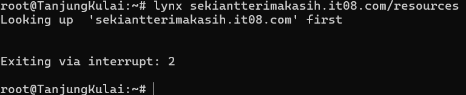
   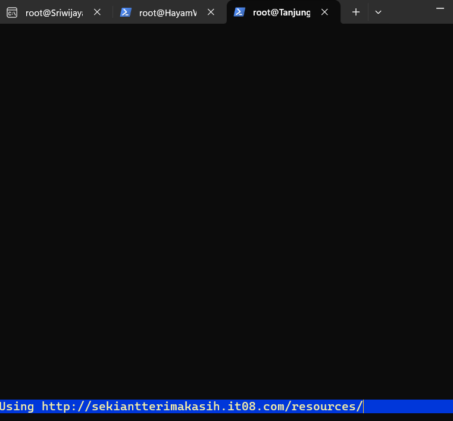
   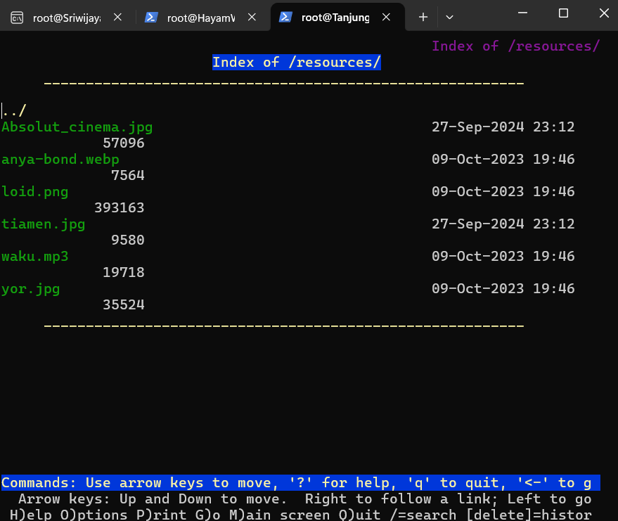
